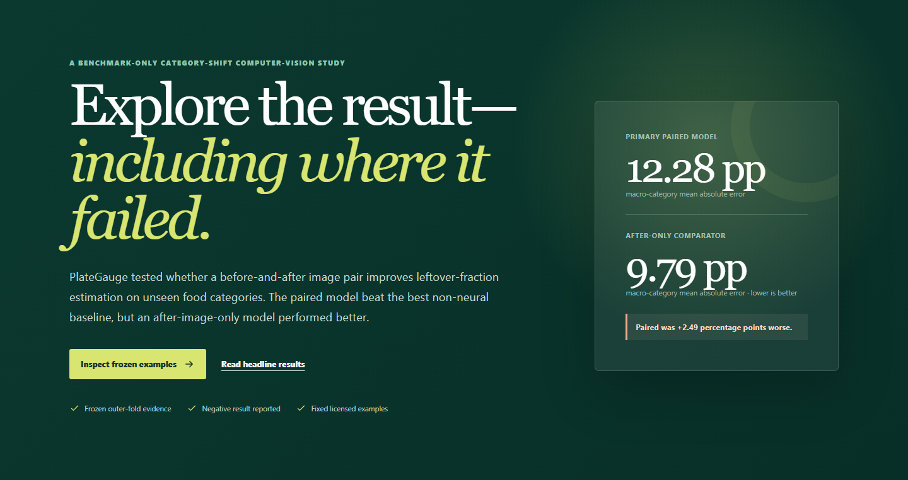

# PlateGauge

**Compare vision models. Explore the evidence behind food-leftover estimates.**

[Open the live demo](https://aldaqrouqtaysir.github.io/plategauge/) ·
[Benchmark results](docs/RESULTS.md) ·
[Five-minute walkthrough](docs/REVIEWER_QUICKSTART.md) ·
[Run locally](docs/DEVELOPMENT.md)

PlateGauge turns a computer-vision study into an interactive benchmark and
failure explorer. Compare compact models, inspect held-out examples, and see
where estimates break down across food categories—not just how they perform
on average.



## Explore the project

- **Compare models:** paired and after-only MobileNet, handcrafted baselines,
  and heavier vision-model references under a documented evaluation protocol.
- **Inspect evidence:** browse licensed fixed examples alongside frozen
  predictions, reference fractions, and errors.
- **Understand failures:** examine target-range disparities, category shift,
  robustness checks, and the limits of uncertainty estimates.
- **Trace the results:** follow visible values back to versioned reports,
  manifests, model checksums, and automated integrity checks.

The released website is a **fixed-example research explorer**, not a camera or
upload-based food estimator. No raw-dataset download or training is needed to
use it. The current public release is
[v1.0.2](https://github.com/aldaqrouqtaysir/plategauge/releases/tag/v1.0.2);
development on `main` does not automatically deploy the website.

## At a glance

| Research and engineering | Implementation |
|---|---|
| Task | Fraction of a single food item remaining in standardized before/after photographs |
| Benchmark | 514 valid LeFood-Set v1 pairs, 34 food categories |
| Evaluation | Duplicate-safe, category-disjoint nested cross-validation |
| Compact model | Shared MobileNetV3-Small encoder, paired feature fusion, ordered quantile head |
| Browser stack | React, TypeScript, Web Worker, ONNX Runtime Web/WASM |
| Model artifact | 10.36 MB FP32 ONNX, SHA-256 verified |
| Privacy | No visitor uploads, accounts, analytics, or application database |

## What the evaluation found

Lower macro-category mean absolute error (MAE) is better. Fractions run from
zero to one; an MAE of `0.10` is ten percentage points of leftover fraction.

| Model | Macro-category MAE |
|---|---:|
| After-only MobileNet | **0.0979** |
| Paired MobileNet | 0.1228 |
| Handcrafted features + Ridge | 0.2515 |

The paired model beat the handcrafted baseline, but **adding the before image
did not improve on after-only MobileNet** in this protocol. The paired-minus-
after-only difference was `+0.0249`, with a category-bootstrap 95% interval of
`[0.0077, 0.0437]`. This interval is conditional on the frozen folds, seed,
recipes, and predictions; it does not measure uncertainty across retraining
or real-world populations.

The dataset is endpoint-heavy: 254 of 514 records (`49.4%`) are exactly empty
or exactly full. Interior target ranges are harder. The paired model did not
meet the predefined numeric-demo, interval, useful-abstention, or robustness
criteria, so the public interface exposes the evidence without offering new
estimates for visitor images.

See the [full results and acceptance criteria](docs/RESULTS.md),
[machine-readable results](reports/results.json),
[error analysis](docs/ERROR_ANALYSIS.md), and
[robustness report](docs/ROBUSTNESS.md).

## How it works

The research model uses the same visual encoder for both images, then fuses
their embeddings, absolute difference, and elementwise product. Its target is:

```text
leftover_fraction = recorded_weight_after / recorded_weight_before
```

The public explorer renders precomputed benchmark evidence. Its normal route
does not initialize the model. A separate verification route replays bundled,
hash-checked examples in-browser without displaying new numeric estimates.
See the [system card](docs/SYSTEM_CARD.md) and [model card](docs/MODEL_CARD.md).

## Run locally

Use Node.js 22 and the repository-pinned `pnpm@11.19.0`:

```sh
git clone https://github.com/aldaqrouqtaysir/plategauge.git
cd plategauge/web
pnpm install --frozen-lockfile
pnpm dev --host 127.0.0.1
```

Open the local URL printed by Vite. For dependency setup, lint/type checks,
unit tests, production builds, and browser verification, see the
[development guide](docs/DEVELOPMENT.md). Building the website does not require
the raw LeFood dataset, model training, or paid services.

## Scope and limitations

This study uses one controlled Indonesian hospital acquisition setup. It does
not establish accuracy for arbitrary meals, uncontrolled phone photography,
UAE cuisines, or other institutions. PlateGauge does not identify foods,
estimate nutrition, replace a scale, support clinical decisions, or claim
measured food-waste reduction.

Visitor images are not accepted. GitHub Pages and the visitor's network may
still process ordinary request metadata; see the
[privacy notice](docs/PRIVACY_NOTICE.md). Browser timing measurements apply
only to the documented reference laptop, not unmeasured phones or devices.

## Repository map

```text
src/plategauge/       Python data, models, training, evaluation, and export
web/                 React/TypeScript benchmark explorer and browser tests
configs/             Frozen experiment configurations
data/                Manifests and provenance; raw data stays outside Git
tests/               Python and integrity tests
reports/             Frozen results, figures, and release evidence
docs/                Methods, cards, development, and project records
.github/workflows/   CI, guarded releases, and monitoring
```

## Further reading

- [Evaluation protocol](docs/EVALUATION_PROTOCOL.md) and [research decisions](docs/RESEARCH_DECISIONS.md)
- [Datasheet](docs/DATASHEET.md), [data licenses](docs/DATA_LICENSES.md), and [reproducibility note](docs/REPRODUCIBILITY_NOTE.md)
- [Claim-evidence map](docs/CLAIM_EVIDENCE_MAP.csv), [contribution record](docs/AUTHORSHIP.md), and [development disclosure](docs/AI_ASSISTANCE_PUBLIC.md)
- [Contributing](CONTRIBUTING.md), [security](SECURITY.md), and [monitoring](docs/MONITORING_AND_FAILURES.md)

Source code is [Apache-2.0](LICENSE). LeFood-Set v1 and the dataset-derived
trained artifact carry CC BY 4.0 attribution and change notices; see [NOTICE](NOTICE).
Historical release records describe their dated state, not the status of every
later checkout. Released scientific evidence, model identity (`v1.0.0`), and
existing release tags are unchanged by this documentation repair.
