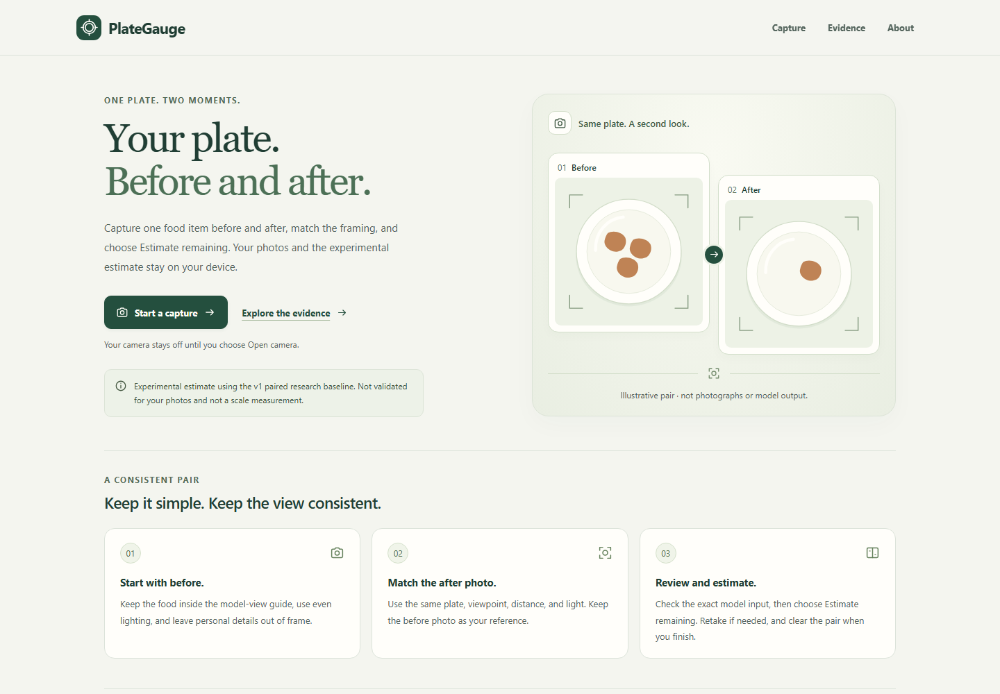
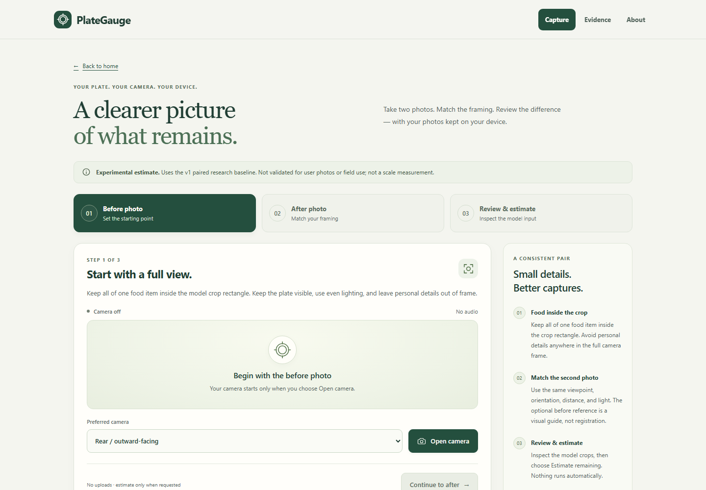

# Published camera interface screenshots

Captured on 23 September 2026 from the published `camera-experimental-r1`
interface using automated desktop Chromium at a 1440 × 1000 CSS-pixel viewport
and device scale factor 1. These are unedited viewport screenshots, not full-page
captures, physical-device tests or evidence of estimation accuracy.

## Homepage

Source: [live homepage](https://aldaqrouqtaysir.github.io/plategauge/).
The plate pair is the interface's labeled illustration, not photographs or
model output. File: `camera-home-2026-09-23.png`, 147,444 bytes.
SHA-256: `63ccb2605da0a5c5096240bf7e085c229f13d2189b7178a6102933a94a8153e1`.

## Idle camera workspace

Source: [camera route](https://aldaqrouqtaysir.github.io/plategauge/?capture=1).
No camera was opened and no photos were present. File:
`camera-idle-2026-09-23.png`, 170,183 bytes.
SHA-256: `ee0da4e35f68e7e06fda1193637ba628dabf2348046ee60b7c6dd29b3fcd56ab`.

## Provenance and scope

- Frozen application source: `ca88b440636b8028e60a1e79ae6a51b0539a37ca`.
- Immutable release commit: `ef769694b15a4333787946b5e971a6987cf5334e`.
- Trusted 46-file inventory SHA-256:
  `64ef462efb059e6e6778934dae22a1b8f3fe28a0731d0b71f5ecf37d25b9fc80`.
- The existing release network guard verified each requested static asset's
  bytes against that inventory before browser execution. Only the approved
  same-origin, bodyless GET routes were allowed; redirects, cookies and
  unauthorized network requests fail the check.
- Both screenshot tests passed. Before and after capture, assertions confirmed
  zero camera calls, worker starts, model/runtime requests, uploads, browser
  storage writes and live media tracks. Native camera access was replaced by
  the test safeguard and was never invoked; generated frames were not used.
- The source, deployed bundle and page content were not edited. Browser
  animations were disabled for the screenshot operation. No user photographs,
  mass values, predictions or private session files were collected.
- The retained private QA report has SHA-256
  `76522a130f89d546a4bde596155224e457edcef603a43c47f4a2e75832ff2f34`.
  A report hash identifies the retained observation, not independent certification.

These screenshots supplement, rather than replace, the historical benchmark
media and their manifests. See [current release status](../../docs/CURRENT_RELEASE.md)
for the distinction between software verification and unvalidated camera-photo
accuracy.
